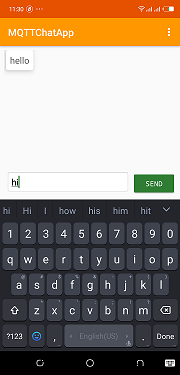

# MQTTChatApp
An app that make use of MQTT protocol. Eclipse paho mqtt library for android and HiveMQ broker were used

<ul>
  <li><a href='http://www.hivemq.com/demos/websocket-client/'>Websocket Client</a></li>
  <li><a href='https://www.eclipse.org/paho/clients/android/'>Paho MQTT library</a></li>
  <li><a href='http://www.mqtt-dashboard.com/'>HiveMQ</a></li>
</ul>

 

